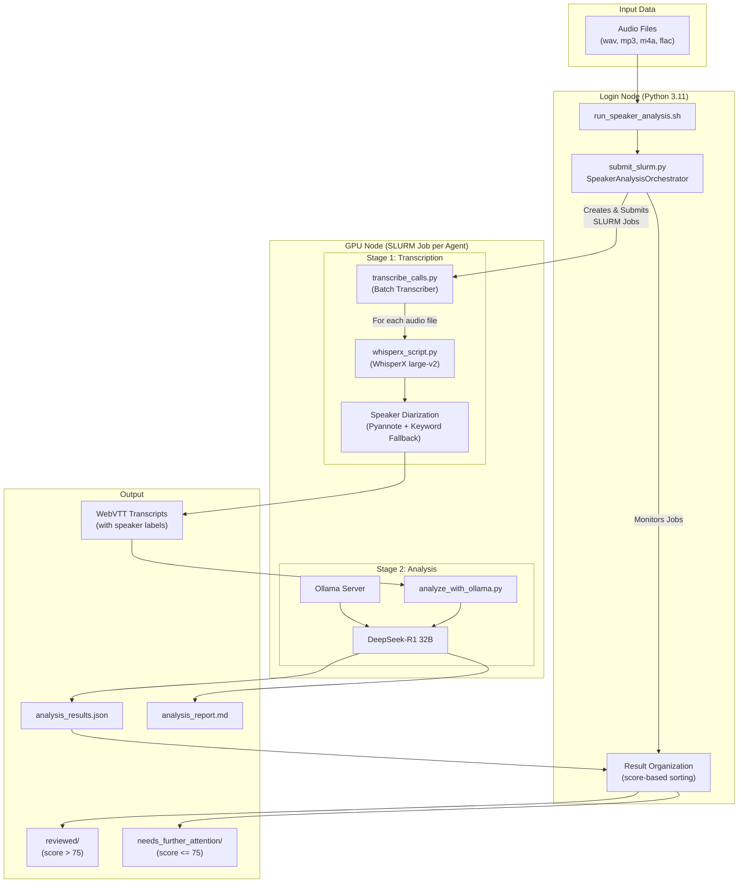
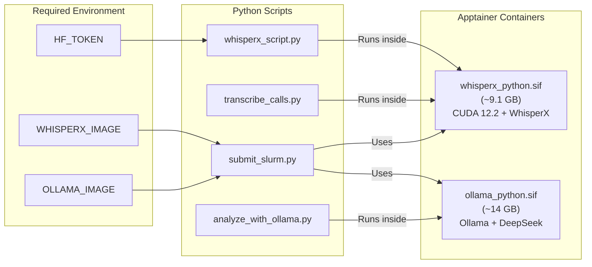
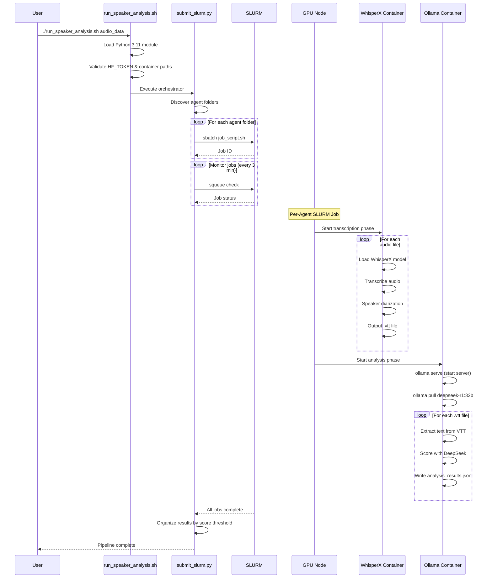
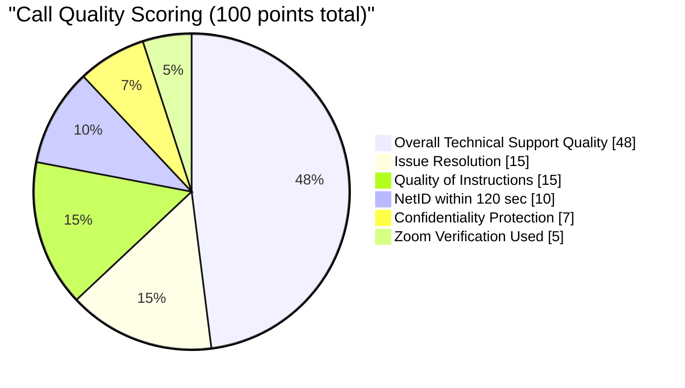
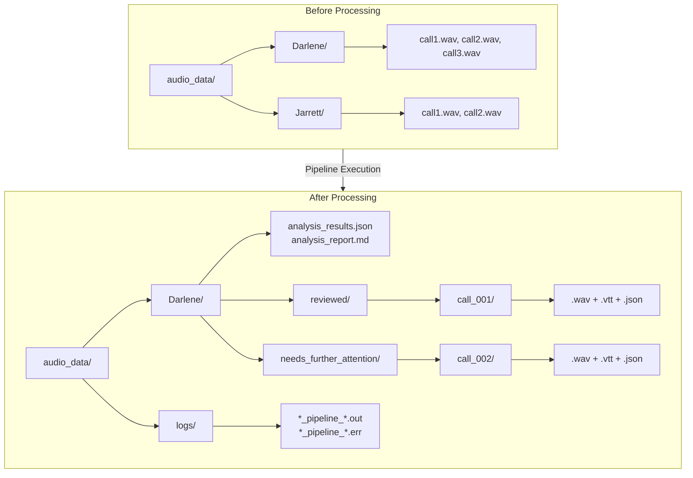
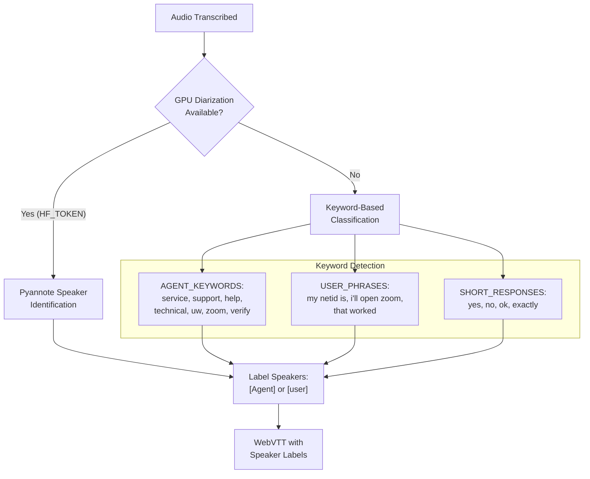

# UWITSC Call Analysis Pipeline - Architecture

## Overview

This pipeline processes customer service call audio files through transcription, speaker diarization, and AI-powered quality analysis on the Hyak supercomputer.

## High-Level Flow

## Detailed Component Diagram

## SLURM Job Flow

## Scoring System

## File Structure After Processing

## Speaker Detection Logic

## Quick Reference

| Component | Location | Purpose |
|-----------|----------|---------|
| `run_speaker_analysis.sh` | Root | Entry point, environment setup |
| `submit_slurm.py` | Root | Job orchestration & result organization |
| `transcribe_calls.py` | Root | Batch audio transcription |
| `whisperx_script.py` | Root | Single-file transcription & diarization |
| `analyze_with_ollama.py` | Root | LLM-based quality scoring |
| `whisperx_python.sif` | Container | WhisperX + CUDA environment |
| `ollama_python.sif` | Container | Ollama + DeepSeek model |
